#  ART-PI最小系统移植指南

[TOC]

## 前提简介

RT-THREAD发布ART-PI提了一个小比赛，觉得挺好玩的就参加了一下。

[ART-PI 裁剪最小系统](https://club.rt-thread.org/ask/question/428858.html)

```
挑战赛概况：

课题：RT-Thread 系统的裁剪

目标：使用 RT-Thread（ V3.1.2以上版本）的 IPC 机制实现 LED 以 1HZ 频率闪烁的功能前提下，尽可能的裁剪出最小可运行的系统

硬件平台：STM32H750

IDE： RT-Thread Studio

**_

评选标准：
_**使用 RT-Thread 的 IPC 机制实现 LED 以 1HZ 频率闪烁的功能，评选出代码最小的三名，同一大小，以投稿时间靠前的为准

投稿要求：

提供裁剪后的源码
投稿前请调整 LED 的引脚为 PI8
```


## 审题分析

小时候做数学题的时候，老师经常讲到，审清题目。

我们先来审下题目，题目要求有以下几点：

- LED小灯1s闪烁一次   （亮灯程序）
- IPC机制     （进程间通信亮灯）
- RT-THREAD v3.1.3版本以上  （IPC使用的RT-THREAD内核机制）
- RT-THREAD STUDIO 开发


## 解决方案

我分几部分来进行：

1. STM32裸机LED亮灯的最小程序最小是怎样的？
2. 在有RT-THREAD的情况下，如何用最小的消耗来实现IPC点亮小灯？
3. 用什么IDE我觉得影响不是很大，主要还是了解MCU的编译原理。


## 裁剪一（最小的裸机亮灯系统）

STM32裸机LED亮灯的最小程序最小是怎样的？

这个时候我们有3条路可以选：

- STM32CUBEMX 创建的时候选LL 库
- STM32CUBEMX 创建的时候选HAL 库
- 直接创建main.c直接点亮小灯

我们都知道用HAL库的代码肯定大于选择用LL库的代码，而我们目前所需要的点亮小灯程序也许不需要那么多库文件，这边我就选择了直接创建main.c来直接点亮小灯。

实际上，你足够厉害的话，可以使用汇编来点亮小灯，不过我综合考虑下RT-THREAD的系统代码级别和代码可读性，以及完成代码的难度上来综合考虑，选择还是C语言来完成。

我分了以下几步

1. 第一步，首先需要有个空的，可以运行main.c的工程，

   这个时候，可以使用debug调试的方法来判断工程是否可以正常run。用一个while循环来判断即可。

2. 第二步，点亮小灯

   这里要了解点亮STM32小灯有哪几个寄存器需要配置。 这边可以去理解下STM32亮灯程序

   我这边总结以下几点：1）RCC时钟要开。 2）引脚模式要配置OUTPUT模式  3）设置引脚高电平还是低电平

   差不多这几项就可以点亮小灯。

我这边提供下我之前调试的main函数：

```
#include "stm32h7xx.h"
#define GPIO_PIN_8                 ((uint16_t)0x0100)  /* Pin 8 selected    */

int main(void)
{
    int i;
    uint8_t abc = 0;
    RCC->AHB4ENR |= RCC_AHB4ENR_GPIOIEN;    //1)RCC开时钟    
    i++;
    GPIOI->MODER = 0xFFFDFFFF;              //2)设置模式
    for(i=0;;)
    {
        if(i == 1000000)
        {
            if(abc == 1)
            {
                GPIOI->BSRR = GPIO_PIN_8;    //设置引脚高低电平
                abc =0;
            }
            else
            {
                abc = 1;
                GPIOI->BSRR = GPIO_PIN_8 << 16;
            }
            i = 0;
        }
        i++;
    }
}
```

这些代码也是我根据HAL库和LL库分析出来的。这个时候如果正常烧入的话，可以看到小灯在闪烁。


这里我们可以看到，代码是比较少的。

工程里面也只有一个main.c文件和system_stm32h7xx.c文件

其实只要3个文件，我们的小灯就可以闪烁起来了。这个时候，我们可以对system_stm32h7xx.c裁剪，因为我们的IDE不一样，汇编语法也会不一样，所以*.s文件后面可能会换，不过也可以尝试，其实道理都是一样的。

具体可以参看当前文件夹下面的工程`01_led_mini_system`

这个时候，我们可以通过keil来熟悉下在这个裸机情况下最小系统如何达到最小系统，（这边只是熟悉一下，具体的rtstudio的文件不太一样）。

### startup_stm32h750xx.s

startup_stm32h750xx.s这个文件中外设中断向量表占了很多codesize，可以优化掉。

- 外设中断
- 内部中断一些不常用的也可以删掉

### SystemInit

这个函数中，一些多余的代码可以优化掉，优化后的代码如下，这个差不多可以优化0.04KB代码:

```
void SystemInit (void)
{

  /* FPU settings ------------------------------------------------------------*/
  #if (__FPU_PRESENT == 1) && (__FPU_USED == 1)
    SCB->CPACR |= ((3UL << (10*2))|(3UL << (11*2)));  /* set CP10 and CP11 Full Access */
  #endif
  /* Reset the RCC clock configuration to the default reset state ------------*/
  /* Set HSION bit */
  RCC->CR |= RCC_CR_HSION;

  /* Reset CFGR register */
  RCC->CFGR = 0;

  /* Reset HSEON, CSSON , CSION,RC48ON, CSIKERON PLL1ON, PLL2ON and PLL3ON bits */
  RCC->CR &= 0xEAF6ED7FU;


  /* Reset HSEBYP bit */
  RCC->CR &= 0xFFFBFFFFU;

  /* Disable all interrupts */
  RCC->CIER = 0;

  SCB->VTOR = FLASH_BANK1_BASE | VECT_TAB_OFFSET; /* Vector Table Relocation in Internal FLASH */
}

```


## 裁剪二 ( IPC最小资源消耗)

首先对于内核选择上，选择nano比较合适，nano目前版本3.1.3版本，符合题目要求。然后就是IPC方式最小的消耗了。nano里面有semaphore、MUTEX、EVENT、MAILBOX、MESSAGEQUEUE。这几个大小我觉得都差不多，选择一个使用就可以了。因为后面还需要裁剪。

下面就是线程个数的问题了。

我们都知道RT-THREAD里面main函数也是一个线程，idle是一个线程。这两个线程我觉得应该够了，因为我们还有一个中断，systick。这边我采用systick来唤醒main线程来操作。这边就考量如何用最少的资源能够点亮小灯。这边就可以从MASTER分支上做实验，实验如果可以点亮小灯，那说明我们的猜测没问题。最后实验证明，可以点亮小灯。

### keil添加RTOS测试

```
#include "stm32h7xx.h"
#include "rtthread.h"
#define GPIO_PIN_8                 ((uint16_t)0x0100)  /* Pin 8 selected    */
struct rt_semaphore dynamic_sem;

int main(void)
{
    int i;
    rt_sem_init(&dynamic_sem, "dsem", 0, RT_IPC_FLAG_FIFO);
    static rt_err_t result;
    RCC->AHB4ENR |= RCC_AHB4ENR_GPIOIEN;
    GPIOI->MODER = 0xFFFDFFFF;
    while(1)
    {
        result = rt_sem_take(&dynamic_sem, RT_WAITING_FOREVER);
        if(i%2 == 0)
        {
            GPIOI->BSRR = GPIO_PIN_8;
        }
        else
        {
            GPIOI->BSRR = GPIO_PIN_8 << 16;
        }
        i++;
    }
}

uint32_t count = 0;
extern struct rt_semaphore dynamic_sem;
void SysTick_Handler(void)
{
    /* enter interrupt */
    rt_interrupt_enter();
    count++;
    if(count >= RT_TICK_PER_SECOND)
    {
        count = 0;
        rt_sem_release(&dynamic_sem);
    }
    rt_tick_increase();

    /* leave interrupt */
    rt_interrupt_leave();
}

```

这边我通过用keil直接添加RTOS pack包的方式然后直接生成可以使用的工程即可


这个时候，我们看到工程已经很小了，这个工程在02_led_rtthread_mini_system_keil：

```
Program Size: Code=10394 RO-data=1450 RW-data=72 ZI-data=1944  
```

## 裁剪三（合并工程）

这个时候我们就需要整合一个工程，这个时候，我的思路是：

- 先用RTTHREAD STUDIO新建一个nano工程
- 然后使用keil中的代码来替换

这边我就不详细展开了，具体可以参考官方的RT THREAD STUDIO的视频教程。

###  system_init

我们先把之前提到的[SystemInit](#SystemInit) 先把除了RTOS以外的外围代码优化一下

这边优化的文件有startup_stm32h750xx.S 和system_stm32h7xx.c。感兴趣的可以自行比较一下。

整合之后，我们看到我们的代码大小：


这个时候我们就来到了工程03_rtstudio_mini_rtthread

## 裁剪四（修改编译器选项）

这边我在做的时候，直接用map文件进行删减代码，导致后来修改编译器选项的时候有一些东西跑不起来。当然也是我通过map文件才发现需要修改编译器选项。所以后来总结了一下，应该先修改编译选项：

编译选项有以下几点：

- 最高优化等级-Os
- 将每个函数变成.o进行链接 -ffunction-sections -fdata-sections
- 不适用标准库   -nostdlib  
- 不启用FPU用softfpu (当前项目暂时不需要FPU，可以节省代码)

下面我们来一步一步的来操作一遍，看看到底每次能减少多少的codesize， 这个时候需要注意的是，由于整个工程是Makefile构成的，所以有时候会有一些缓存在里面，所以，我们要每次清理一下工程再构建。或者全部重新构建。

### 优化s级别


优化界面中，选中-Os之后

代码差不多缩减了一半


###  优化--ffunction-sections

**-ffunction-sections** 编译源文件时，为每个function分配独立的section。这个选项工作中经常会用到的。

-fdata-sections 编译源文件时，为每个data分配独立的section。

在优化界面选中--ffunction-secionts


因为我们数据不多，所以-fdata-secions 这个选项优化程度不大，我看过，基本没有缩减代码。

###  优化标准库

```
-nostdlib 不使用标准库
```


优化下来大小差不多是：


### 优化FPU

使用软件FPU可以优化一些代码，


优化之后代码差不多是：

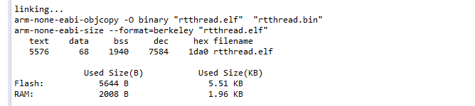


好，这个时候，我们基本已经成功一大半了。这个时候，我们来看下RTTHREAD nano官方给出的占用情况：


我们可以看到，距离还差一些。

这个时候一定要及时的烧入查看下led小灯是否可以亮起来

## 裁剪五（对rtconfig.h RTTHREAD配置）

RTThread一些默认配置是不需要的：

rtconfig.h中的大部分配置是可以去掉的，你可以试着去掉然后编译烧入看小灯是否还能闪烁。

我这边就保留我最后留下来的配置

```
#define RT_USING_SEMAPHORE //这个要实现IPC通信，是需要留下来的

#define RT_THREAD_PRIORITY_MAX  3  //这个是最大的优先级数，这个可以减少到3

#define RT_USING_USER_MAIN  //这个涉及到stdlib，所以留着可以节省空间

#define RT_MAIN_THREAD_STACK_SIZE     128  //这个也是实验得来的数据

#define RT_USING_CPU_FFS  //这个选项可以将大数组__lowest_bit_bitmap优化掉使用CPU指令

#define RT_USING_COMPONENTS_INIT

#define RT_TICK_PER_SECOND  1000
```

下面我们来看看具体的配置能减少差不多多少：

### RT_USING_CPU_FFS

这个是使用CPU的FFS，可以将一个比较大的数组优化成CPU命令：

差不多是0.3KB的样子：


### RT_USING_CONSOLE

这个优化强度比较大，console系统，差不多占2KB的大小，因为我们暂时用不掉console，


### RT_MAIN_THREAD_STACK_SIZE

RT_MAIN_THREAD_STACK_SIZE这个占RAM大小，

其他编译选项优化空间有限，我就不一一介绍了。可以把下面的头文件放到你的rtconfig.h中查看具体有多少代码缩减

```
#define RT_THREAD_PRIORITY_MAX  3

#define RT_TICK_PER_SECOND  1000

#define RT_ALIGN_SIZE   4

#define RT_NAME_MAX    4

#define RT_USING_COMPONENTS_INIT
// </c>

#define RT_USING_USER_MAIN


#define RT_MAIN_THREAD_STACK_SIZE     128

#define RT_USING_CPU_FFS

#define RT_USING_SEMAPHORE
```


最后代码停留在这个大小：


这个时候，我们就来到工程04_nostdlib_mini_rtthread

##  裁剪六（根据map文件，来裁剪代码）

这部分其实比较枯燥，也比较重要，因为拿到名次可能和这个比较相关一些。

主要看map文件来检查一些点。

*.map文件在debug里面相信大家一定会找了，我这边介绍下如何查看函数的大小，截取map文件中的一个片段

```
 .text.rt_tick_increase
                0x080000f0       0x28 ./rt-thread/src/clock.o
                0x080000f0                rt_tick_increase
 .text.rti_end  0x08000118        0x4 ./rt-thread/src/components.o
 .text.main_thread_entry
                0x0800011c        0x4 ./rt-thread/src/components.o
                0x0800011c                main_thread_entry
 .text.rti_board_end
                0x08000120        0x4 ./rt-thread/src/components.o
 .text.rti_start
                0x08000124        0x4 ./rt-thread/src/components.o
 .text.rti_board_start
                0x08000128        0x4 ./rt-thread/src/components.o
 .text.rt_application_init
                0x0800012c       0x3c ./rt-thread/src/components.o
                0x0800012c                rt_application_init
```

- STM32代码在ROM里面从0x08000000开始的，所以要从map里面这个地址开始找起来。

上面找了个片段：

rt_tick_increase这个函数从0x080000f0地址开始，大小是0x28

rt_application_init这个函数从0x0800012c地址开始，大小是0x3c

就这样一点一点的扣代码。


### timer 裁剪

由于timer我们没有用到，timer.c里面的函数基本用不到，我们可以全部注释掉，相关调用也注释掉。整个TIMER差不多占了0.6KB左右。

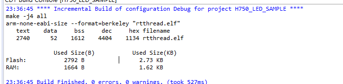

### rt_memset和rt_memcpy 可以优化掉

在kservice.c中，整个文件都可以注释掉，把相关的调用也注释掉。整个差不多占用0.08KB

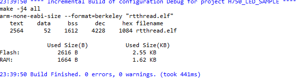


### rt_thread_exit

我们追求极致的话，线程退出，其实也是不做要求的，thread.c中。这里差不多是0.08KB左右的代码

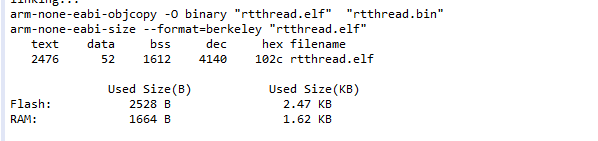


### idle task

idle task 中有一些操作，可以将代码注释掉在idle.c

这边尝试了一下，只保留一个while循环，小灯也可以闪烁。这部分代码差不多是0.15KB左右

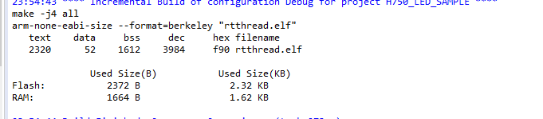

### hardfault的处理

hardfault这边也占了一些codesize，可以优化掉，hardfault的实现实在contex_gcc.S中，由于gcc未将.s文件优化掉（就是不用的汇编没法优化掉，只能一点点的删减）这个差不多节省0.08KB

- startup_stm32h750xx.s中也要将hardfault处理函数去掉。

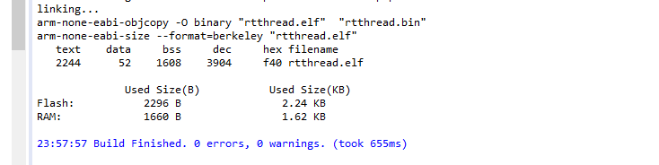

### rt_critical

临界区，由于没有进程间竞争，进入临界区可以优化掉，scheduler.c

rt_enter_critical 和rt_exit_critical

差不多可以节省0.09KB

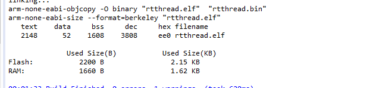

### rt_components_init

对于components一些选项，也是可以优化掉的。

这个差不多可以节省0.04KB

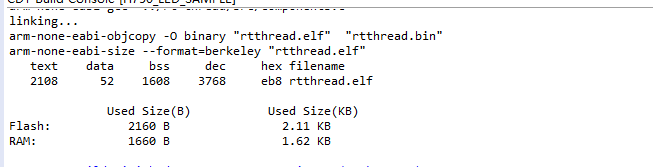

### rt_hw_interrupt_enable

这边我们线程比较少，对于开关总中断可以优化掉。在thread.c中

这个差不多可以节省0.2KB

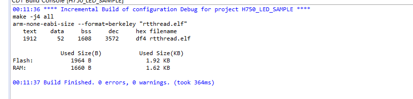

### rt_interrupt_enter 

中断比较少，rt_interrupt_enter这个进中断和出中断可以裁剪掉，差不多是0.4KB。

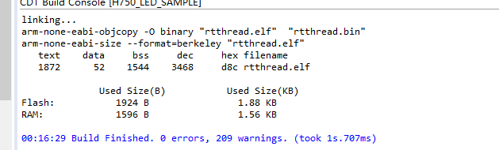

还有这个函数rt_hw_interrupt_thread_switch

### rt_components_board_init

这个函数可以去掉，大约省0.03KB

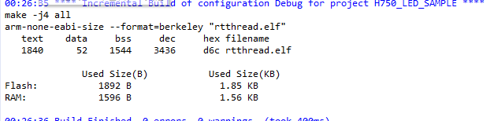


### rt_ipc_list_suspend

这个函数中 case RT_IPC_FLAG_PRIO:这个部分是不需要的，我们直接注释掉会节省0.05KB

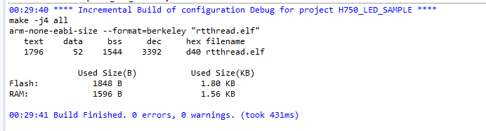


### inline函数优化

inline函数在编译的时候，是将代码整个放到函数中的，如果过多，会导致一些代码量过大

rt_service.h

这边我以为会把inline函数改成函数，使得代码有所减少，后来复盘的时候，发现，实际上代码量是增加的

增加了0.07KB。这充分说明了，inline函数写的好，实际上是会减少codesize的。

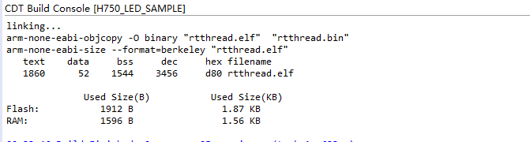


### rt_thread

rt_thread这个结构体struct rt_thread 里面有一些东西可以优化掉。减少codesize

`struct rt_timer thread_timer;   ` 这个成员相关的代码可以删掉

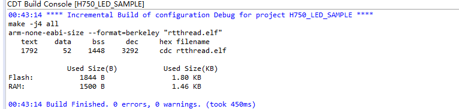

基本差不多了。


基本删减代码就用时间来堆积了，没啥太大要讲的内容了。其实主要觉得比较有意思一点。主要也是想把我自己知道的经验传递给大家，让大家对内核结构有个更好的认识

最后工程05_final_cut_mini_system


剩下的我觉得还有以下一些优化空间，如果大家已经做了，可以PR到我的仓库来，我们一起来实现最最小的RTTHREAD操作系统。

- 用汇编写main函数
- 一些跑不到的if可以删掉

https://github.com/supperthomas/H750_MINI_RTT.git

这个是我的仓库大家可以提交到05_final_cut_mini_system这个工程里面。


## 成果

交稿的那个工程的最后成果


## 总结：

个人要找到裁剪中间的乐趣，找到乐趣了，你就可以钻研下去了。也要掌握学习方法。

1. 大部分的裁剪手段都需要实验来验证结果。因为最后都要达到程序可以跑的目的。
2. 调一部分总结一部分，并且可以整理一部分。
3. 基本每调整一个功能，都要测试一下小灯是否可以闪烁。
4. 推荐阅读一本《程序员的自我修养》这本书对这个项目的帮助其实挺大的，我还是很早之前读过一次。
5. 其实作为程序员，建议不能一味的贪多做大项目，其实做的越多，错的越多，能多总结，多研究内部的机理，能够获取到很多知识。其实这次挑战看起来很简单，其实就是个点灯的问题。实际上需要学习的知识点非常多，需要掌握的知识也非常多。我们应该多把握一些简单的事情，因为越是看起来简单的事情，你把它做的不简单都能学到很多东西。
6. 我们应该学会从简单的事情中掌握事情的本质。

## 愿景

​        我在github上面建了个仓库，放了我最后的代码，以及一些commit的内容，和一步步裁剪的流程。我知道很多人都参加了比赛，可能你有些比较好的裁剪方案，可以PR到我这个仓库里来，我们一起来维护，如果您觉得还有裁剪空间，您可以继续PR来裁剪下去，一直裁剪到最小rtthread。

https://gitee.com/superThomas/h750_-mini_-system.git

## 给小伙伴的建议

- 写文档，分享文档很重要。
- 学会坚持，坚持就是持之以恒的做好一件事情
- 学习匠人精神，把简单的事情做好到极致。
- 学习是一个持续性的过程，有时候当你了解一个知识的时候，可以想一下，下次再捡起来的时候，你还需要多长时间的记忆，为何不把它记录下来，分享一下。然后成为一份经典呢。

